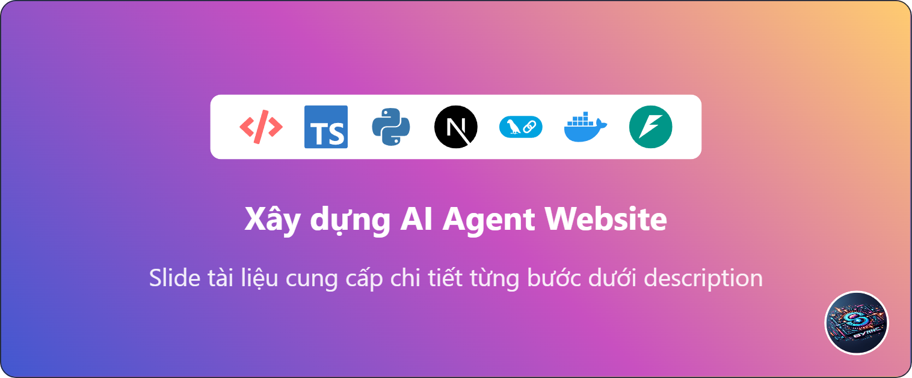

# Hướng dẫn Triển khai Ứng dụng Chat với LLM



[Video hướng dẫn bấm vào đây](https://youtu.be/DzA1zo9vEZ4)

[Xem pdf bấm vào đây](./docs/docker.pdf)

## Mục lục
- [Giới thiệu](#giới-thiệu)
- [Kiến trúc hệ thống](#kiến-trúc-hệ-thống)
- [Yêu cầu hệ thống](#yêu-cầu-hệ-thống)
- [Cài đặt và Triển khai](#cài-đặt-và-triển-khai)
- [Chi tiết các Component](#chi-tiết-các-component)
- [Tài liệu tham khảo](#tài-liệu-tham-khảo)

## Giới thiệu

Dự án này là một ứng dụng chat tích hợp mô hình ngôn ngữ lớn (LLM) sử dụng:
- Frontend: Next.js 15+ với App Router
- Backend: FastAPI 
- LLM: Ollama với mô hình Qwen
- Database: SQLite với SQLModel

## Kiến trúc hệ thống

```mermaid
graph LR
    A[User Query] --> B[FastAPI Backend]
    B --> C[Template Engine]
    C --> D[LangChain Chain]
    D --> E[Ollama LLM]
    D --> F[(SQLite DB)]
    
    subgraph Template Processing
        C --> G[PromptTemplate]
        G --> H[Table Info]
        H --> I[Question]
    end
    
    subgraph LangChain Pipeline
        D --> J[llm_chain]
        J --> K[StrOutputParser]
    end
    
    subgraph Database Operations
        F --> L[Store Chat]
        F --> M[Execute SQL]
    end
```

## Yêu cầu hệ thống

- Docker và Docker Compose
- Node.js 18+ (cho development)
- Python 3.11+ (cho development)
- Git

## Cài đặt và Triển khai

### 1. Clone repository

```bash
git clone <repository-url>
cd <project-folder>
```

### 2. Cấu trúc thư mục

```
.
├── docker-compose.yml
├── fastapi/
│   ├── Dockerfile
│   ├── app.py
│   ├── requirements.txt
│   └── ...
├── nextjs-app/
│   ├── Dockerfile
│   ├── package.json
│   └── ...
└── ollama/
    ├── Dockerfile
    └── pull-qwen.sh
```

### 3. Docker Compose

```yaml
version: '3.8'

services:
  frontend:
    build: ./nextjs-app
    ports:
      - "3000:3000"
    volumes:
      - ./nextjs-app:/app
    depends_on:
      - backend

  backend:
    build: ./fastapi
    ports:
      - "8000:8000"
    volumes:
      - ./fastapi:/app
    depends_on:
      - ollama-server

  ollama-server:
    build: ./ollama
    volumes:
      - ollama_data:/root/.ollama
    deploy:
      resources:
        reservations:
          devices:
            - driver: nvidia
              count: 1
              capabilities: [gpu]

volumes:
  ollama_data:
```

## Chi tiết các Component

### FastAPI Backend

FastAPI backend xử lý các request từ frontend và tương tác với Ollama LLM. Code chính trong `app.py`:


```1:109:fastapi/app.py
import requests
from fastapi import FastAPI, Response

# Database
from db import (
    create_chat,
    get_all_chats,
    get_chat_by_id,
    delete_chat,
    DataChat,
    path_db
@app.get('/ask')
def ask(prompt :str):
# Langchain
from langchain_ollama import OllamaLLM # Ollama model
from langchain_ollama.llms import BaseLLM # Lớp cơ sở của LLM
from langchain.chains.llm import LLMChain # xử lí chuỗi các LLM
from langchain.chains.sql_database.query import create_sql_query_chain # tạo câu truy vấn cơ sở dữ liệu từ llm
from langchain.prompts import PromptTemplate # tạo câu truy vấn từ mẫu
from langchain_community.tools import QuerySQLDataBaseTool # công cụ truy vấn cơ sở dữ liệu
from langchain.sql_database import SQLDatabase # cơ sở dữ liệu
from langchain_core.output_parsers import StrOutputParser, PydanticOutputParser # xử lí kết quả trả về là kiểu dữ liệu chuỗi
from langchain_core.runnables import RunnablePassthrough # truyền đa dạng đối số
from operator import itemgetter # lấy giá trị từ dict
# Cache
from langchain.cache import InMemoryCache
from langchain.globals import set_llm_cache
#--------------------------------------------------
llm = OllamaLLM(
# Utility
from utils import get_sql_from_answer_llm
)
#test on docker
url_docker = "http://ollama-server:11434"
#test on local
url_local = "http://localhost:11434"
model = "qwen2.5-coder:0.5b"
app = FastAPI()
llm = OllamaLLM(
    base_url=url_local, 
    model=model
)
@app.get('/')
cache = InMemoryCache()
set_llm_cache(cache)

@app.get('/ask')
template = PromptTemplate.from_template(
    """
    Từ các bảng cơ sở dữ đã có: {tables}
    Tạo câu truy vấn cơ sở dữ liệu từ câu hỏi sau:
    {question}

    Trả lời ở đây:
    """
)
# nếu câu hỏi không liên quan đến các bảng cơ sở dữ liệu đã có thì trả lời là "Không liên quan đến các bảng cơ sở dữ liệu đã có", và nếu câu hỏi gây nguy hiểm đến cơ sở dữ liệu thì trả lời là "Không thể trả lời câu hỏi này"

llm_chain = (
    template |
    llm |
    StrOutputParser()
)

db = SQLDatabase.from_uri(f"sqlite:///{path_db}")


app = FastAPI()


@app.get('/')
def home():
    return {"hello" : "World"}

@app.get('/ask')
def ask(prompt :str):
    # name of the service is ollama-server, is hostname by bridge to connect same network
    # res = requests.post('http://ollama-server:11434/api/generate', json={
    #     "prompt": prompt,
    #     "stream" : False,
    #     "model" : "qwen2.5-coder:0.5b"
    # })

    res = llm_chain.invoke({
        "tables": f'''{db.get_table_info(db.get_usable_table_names())}''',
        "question": prompt
    })
    
    response = ""
    if isinstance(res, str):
        response = res
    else:
        response = res.text
        
    # Store chat in database
    chat = create_chat(message=prompt, response=response)

    try:
        data_db = db.run(get_sql_from_answer_llm(response))
    except Exception as e:
        data_db = str(e)
    
    return {
        "answer": response, 
        "data_db": data_db
    }
```


Giải thích các thành phần chính:
- Sử dụng LangChain để tương tác với Ollama
- Cache LLM responses để tối ưu performance
- Xử lý SQL queries từ user input
- Error handling cho database operations

### Ollama Server

Ollama server chạy mô hình Qwen và expose API. Setup trong `pull-qwen.sh`:


```1:14:ollama/pull-qwen.sh

./bin/ollama serve &

pid=$!

sleep 5


echo "Pulling qwen2.5-coder model"
ollama pull qwen2.5-coder:0.5b


wait $pid

```


### Next.js Frontend

Frontend sử dụng Next.js 13+ với App Router và Tailwind CSS. Tham khảo cấu hình trong:


```1:24:nextjs-app/package.json
{
  "name": "nextjs-app",
  "version": "0.1.0",
  "private": true,
  "scripts": {
    "dev": "next dev --turbopack",
    "build": "next build",
    "start": "next start",
    "lint": "next lint"
  },
  "dependencies": {
    "react": "19.0.0-rc-66855b96-20241106",
    "react-dom": "19.0.0-rc-66855b96-20241106",
    "next": "15.0.3"
  },
  "devDependencies": {
    "typescript": "^5",
    "@types/node": "^20",
    "@types/react": "^18",
    "@types/react-dom": "^18",
    "postcss": "^8",
    "tailwindcss": "^3.4.1"
  }
}
```


## Tài liệu tham khảo

- [FastAPI Documentation](https://fastapi.tiangolo.com/)
- [Next.js Documentation](https://nextjs.org/docs)
- [Ollama GitHub](https://github.com/ollama/ollama)
- [LangChain Documentation](https://python.langchain.com/docs/get_started/introduction.html)
- [SQLModel Documentation](https://sqlmodel.tiangolo.com/)

## Contributing

Vui lòng đọc [CONTRIBUTING.md](CONTRIBUTING.md) để biết thêm chi tiết về quy trình đóng góp code.

## License

Dự án này được phân phối dưới giấy phép MIT. Xem file [LICENSE](LICENSE) để biết thêm chi tiết.